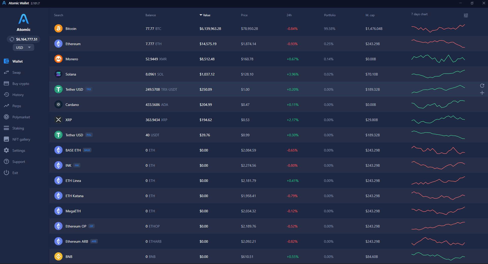

# Atomic Wallet — Fake Balance

Faithfully replicates the Atomic Wallet desktop interface and makes core interactions
(receive, swap, send, asset management, etc.) **truly functional**.
**Live real-time prices and 24h changes are fetched from a public market API (CoinGecko)**;
balances, transactions, and addresses are a **local simulation**. **No blockchain,
no wallet keys, no real fund movement**; every balance and address is local and fictional.


> **Not official and not affiliated.** This is an independent interface study for
> learning and portfolio purposes. It is not affiliated with or endorsed by Atomic Wallet.
> It is not a real wallet; it cannot hold, send, or receive any funds. All data is fictional.



---

## Table of contents

- [Highlights](#highlights)
- [Screens & features](#screens--features)
- [How the simulation works](#how-the-simulation-works)
- [Tech stack](#tech-stack)
- [Getting started](#getting-started)
- [Project structure](#project-structure)
- [Documentation](#documentation)
- [Attribution](#attribution)
- [Disclaimer](#disclaimer)
- [License](#license)

---

## Highlights

- **Functional, not just a mockup** — Buy increases your balance and records an order,
  Swap exchanges value between assets using live (simulated) prices, Send reduces the
  balance, Manage assets actually shows/hides coins.
- **Live market data** — real prices, 24h changes, **market caps**, and
  **7-day sparklines** are fetched from CoinGecko every 30 seconds; **the price chart
  shows real historical data for every interval (24H–ALL)**; **currency conversion uses
  live exchange rates**.
- **Persistent state** — balances, transaction history, selected currency, hidden assets,
  and order history are saved to disk and restored on the next launch.
- **Multi-currency** — switch the display currency (USD, EUR, GBP, BTC);
  every fiat value is recalculated live.
- **Clean MVVM** — strict separation of Models / Services / ViewModels / Views,
  `Microsoft.Extensions.DependencyInjection` for DI, and source-generator observable properties.

## Screens & features

| Screen | What it does |
|--------|--------------|
| **Wallet** | Full asset table — balance, value, price, 24h change, portfolio %, market cap and a 7-day sparkline. Sortable columns, live search, row striping/hover and clickable rows. |
| **Portfolio** | A donut overview of holdings plus a sortable holdings table (opens from the sidebar logo / total widget). |
| **Asset detail** | Per-coin header with **Receive / Send / Swap / Buy** actions and three tabs: **Transactions**, **Price Chart** (area chart with 24H · 1W · 1M · 1Y · ALL ranges) and **About**. A coin switcher lets you jump between assets. |
| **Send** | Address + amount form with live fiat conversion, an inline **Set fee** slider and **Send all**. Debits the balance and writes a transaction. |
| **Receive** | A generated **QR code** (QRCoder) plus the copyable address. |
| **Swap** | **Instant Swap** between any two assets at simulated prices, with **Send all** and an **Order History** tab. Actually moves balances. |
| **Buy crypto** | Fiat → crypto purchase that credits the wallet and appends to a persistent **Order History** with status, payment method and timestamp. |
| **History** | Global transaction list with search and expandable rows (from / to / hash / copy). |
| **Perps** | Perpetuals market table with leverage badges, funding rate and a summary strip. |
| **Polymarket** | Prediction-market cards with category chips and Yes/No (or Up/Down) outcomes. |
| **Staking** | Stakeable assets with APR figures. |
| **NFT gallery** | Gallery screen scaffold. |
| **Settings** | **Security** (working change-password validation) and **Private Keys** (password-gated UI shell — no real keys exist). |
| **Manage assets** | Toggle which coins/tokens appear in the wallet, with search, **Hide zero balance** and **Disable notifications** — all applied and persisted. |

Cross-cutting:

- Sortable + searchable tables (Wallet and Portfolio), with sort-arrow indicators.
- In-app toast notifications (can be disabled).
- An **Exit confirmation** dialog and a custom title bar with minimize / maximize-restore / close.

## How it works

A singleton `MarketDataService` seeds a catalog of coins and tokens and a few non-zero
demo balances. A `PriceFeedService` then fetches **real market data from CoinGecko**
every 30 seconds — prices, 24h changes, market caps and 7-day sparklines in one batched
call, plus live fiat exchange rates — and applies them to the assets; a tiny local
flicker between fetches keeps the number alive. The asset **price chart** pulls real
historical prices for the selected range (24H / 1W / 1M / 1Y / ALL) on demand, falling
back to a synthetic series only while the request is in flight or if it fails. Any
network failure is swallowed, so the app keeps its last known data and runs offline.

User actions mutate the same in-memory model and are persisted as JSON to
`%AppData%/AtomicWallet/state.json` — so your balances, transactions, hidden assets,
display currency and buy/swap activity survive a restart. Delete that file to reset to
the seeded defaults.

> The only network call is the read-only price lookup. There is no blockchain, no
> account/keys and no fund movement — addresses, hashes and balances are fabricated for
> the demo.

## Tech stack

- **.NET 8** (`net8.0-windows`) + **WPF**
- **[CommunityToolkit.Mvvm](https://learn.microsoft.com/dotnet/communitytoolkit/mvvm/)** — observable objects, relay commands, source generators
- **[Microsoft.Extensions.DependencyInjection](https://learn.microsoft.com/dotnet/core/extensions/dependency-injection)** — DI container
- **[QRCoder](https://github.com/codebude/QRCoder)** — QR generation for the Receive screen
- **[CoinGecko public API](https://www.coingecko.com/en/api)** via `HttpClient` — live spot prices
- **System.Text.Json** — local state persistence
- Custom-drawn `FrameworkElement` controls: `Sparkline`, `AreaChart`, `DonutChart`
- No external charting or UI libraries

## Getting started

### Prerequisites

- **Windows 10 / 11**
- **[.NET 8 SDK](https://dotnet.microsoft.com/download/dotnet/8.0)** or newer

### Build & run

```bash
git clone https://github.com/<your-username>/AtomicWallet-WPF.git
cd AtomicWallet-WPF
dotnet run --project AtomicWallet
```

Or open `AtomicWallet.sln` in **Visual Studio 2022** and press **F5**.

### Where data is stored

Runtime state lives in `%AppData%/AtomicWallet/state.json`. Delete it to reset the
demo wallet to its seeded defaults.

## How to use

The wallet starts **completely empty** — every coin shows `0` and the total is `$0`,
exactly like a brand-new wallet. You add a (fake, local) balance yourself:

### 1. Add a balance — Buy crypto
1. Click **Buy crypto** in the sidebar.
2. Choose the coin from the dropdown on the right (e.g. **BTC**).
3. Enter an amount — type it in **USD on the left** *or* directly in **crypto on the
   right**; the two convert both ways live. (Want 7,777 BTC? Just type it on the right
   and the USD value fills in.)
4. Click **CONTINUE**. The amount is credited to your wallet and the purchase is logged
   under **Order History**.
5. Open **Wallet** — the coin now shows your balance, value and portfolio share, and the
   sidebar total reflects it.

### 2. Move balances around
- **Swap** — exchange one coin for another at live prices (use **Send all** to convert
  the whole balance).
- **Send** — debit a balance to any address, with an inline fee and **Send all**.
- **Receive** — show a QR code and a copyable address.

### 3. Tailor the view
- **Manage assets** (the filter icon at the top-right of the Wallet table) — show/hide
  coins and tokens, hide zero-balance rows, search.
- **Currency switcher** (top-left, under the logo) — change the display currency; every
  value reconverts live at real exchange rates.
- **Asset detail** — click any row to open its **Price Chart** (real history),
  **Transactions** and **About** tabs.

### 4. It remembers
Your balances, orders, hidden assets and currency are saved automatically and restored
next launch. To wipe everything back to an empty wallet, delete
`%AppData%/AtomicWallet/state.json`.

> Reminder: balances are entirely fake and local. Prices are real (from CoinGecko), but
> nothing here touches a blockchain — you can't actually buy, send or receive funds.

## Project structure

```
AtomicWallet/
├─ AtomicWallet.sln
├─ AtomicWallet/
│  ├─ App.xaml(.cs)         App startup, DI container, VM→View templates
│  ├─ Models/               Asset, TxItem, PerpMarket, PolyCard, AssetChip, BuyOrder
│  ├─ Services/             MarketDataService (catalog + persistence), PriceFeedService
│  │                        (live CoinGecko prices), NavigationService,
│  │                        NotificationService, JsonStore, Fx
│  ├─ ViewModels/           ShellViewModel + one view model per screen
│  ├─ Views/                MainWindow shell + a UserControl per screen
│  ├─ Controls/             Sparkline, AreaChart, DonutChart (custom OnRender)
│  ├─ Converters/           Value/multi-value converters used across the UI
│  ├─ Themes/               Colors, Typography, Icons, Controls (resource dictionaries)
│  └─ Assets/               App icon, brand mark, coin logos
└─ docs/                    Architecture & design documentation
```

## Documentation

- **[docs/ARCHITECTURE.md](docs/ARCHITECTURE.md)** — application architecture, the MVVM
  layers, navigation, the data/simulation model and the persistence format.
- **[docs/DESIGN.md](docs/DESIGN.md)** — the design system: color tokens, typography,
  spacing/radius and the component inventory.

## Attribution

- **Coin logos** — from [cryptocurrency-icons](https://github.com/spothq/cryptocurrency-icons)
  (CC0 / MIT). See [`AtomicWallet/Assets/coins/ICONS-LICENSE.md`](AtomicWallet/Assets/coins/ICONS-LICENSE.md).
- **UI glyph icons** — recreated as vector `Path` geometries, inspired by common open
  icon sets.
- **Typography** — Roboto.


## Media

> **[▶ docs/AtomicWallet.mp4](docs/AtomicWallet.mp4)**.

## Disclaimer

This project is for educational and demonstration purposes only. It is not a real
crypto wallet: there is no blockchain connection or key management; it cannot hold,
send, or receive real assets. All balances, addresses, and transactions are fictional.
Do not use this project to deceive or mislead anyone.

## License

Released under the [MIT License](LICENSE).
